Hello! I'm @C4lopsitta, I'm a Programmer at Elemento Cloud. 
I love Kotlin and I'm currently working on a Kotlin Multiplatform app [for viewing arrivals and departures in Italian railway staitons](https://github.com/c4lopsitta/rfi-timetable-scraper) along other details.
 
  
 
  
 
<!---
C4lopsitta/C4lopsitta is a ✨ special ✨ repository because its `README.md` (this file) appears on your GitHub profile.
You can click the Preview link to take a look at your changes.
--->
